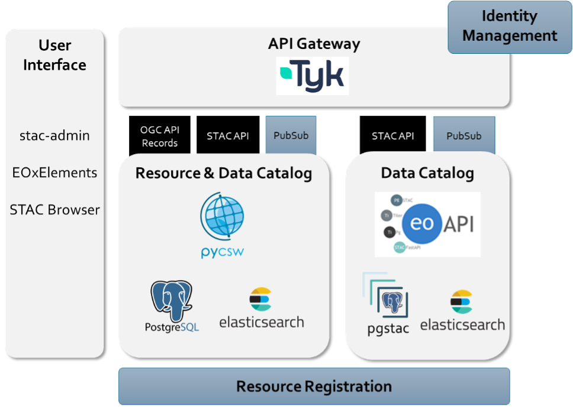

# Architecture

Resource Discovery provides a catalogue that maintains metadata for the resources held within a platform, and also supports platform federation by maintaining records to resources in other platforms.

As described in the [System Architecture document](https://eoepca.readthedocs.io/projects/architecture/) the Resource Discovery Building Block includes the following components:

* **Discovery Interfaces** 
  Extensible set of APIs to support search and discovery. Resource Discovery should present search and browse interfaces. For interoperability these interfaces should be based on open standards: Spatio Temporal Asset Catalog (STAC) and OGC API - Records

* **Metadata Backends** 
  Extensible set of backends in which to persist and query the metadata. The building block establishes separation between its service-layer, and its data storage layer – to facilitate the integration of alternative database technologies, such as PostGIS, ElasticSearch, etc.

* **Resource Handlers** 
  Extensible set of resource types to be handled. The types of resource maintained should be extensible, but should initially include Datasets, Datacubes, Virtual Datacubes, Replicable Workflows, Reproducible Job Details, Jupyter Notebooks, Executable Services, Platform Services, Web Applications, Machine Learning Training Data, Machine Learning Models, Collections, Source Repository, Documentation.

* **Resource Discovery UI** 
  Web-enabled UI providing administrative access to the capabilities of the Resource Discovery BB.

The components design of the Resource Discovery Building Block is shown in the following component figure.

The software pycsw is deployed as Resource Catalogue for all kinds of resources providing OGC API Records, STAC API (as well as OGC CSW, OpenSearch Geo/Time) and connection to the external automation & notification building block supporting the publish-subscribe (PubSub) mechanism.

The Resource Catalogue is focusing on collection metadata as well as resource types, such as workflows, algorithms, job results, services, web applications, Jupyter notebooks, and documentation.

eoAPI is used as Data Catalogue in addition to pycsw providing STAC API and connection to the external automation & notification building block supporting the PubSub mechanism.

Both components are deployed by default with PostgreSQL as a backend. In the roadmap of EOEPCA, support for Elasticsearch as a backend will be implemented. In this setup, collection metadata from the eoAPI-based data catalogue are registered into pycsw (e.g., using the PubSub mechanism) so that the resource catalogue provide a high-level overview of all resources. Operators of the platform may choose to implement one or both of the catalogue components, depending on their requirements.

The web-based administration interface is based on STAC Admin, EOxElements, and STAC Browser allowing for editing STAC and OGC API Records metadata amongst other functionalities.

All APIs are protected with the Tyk-based API Gateway, which connects to the Identity Management building block for authentication and authorization. In addition, Tyk is able to cache requests and conduct rate-limiting.

Further relations exist to the Resource Registration building block, which acts as a transactional client to both catalogue services. In addition, the GitOps-based deployment with Helm Charts and ArgoCD/FluxCD ensures the integration of the proposed components into the Workspace building block.

