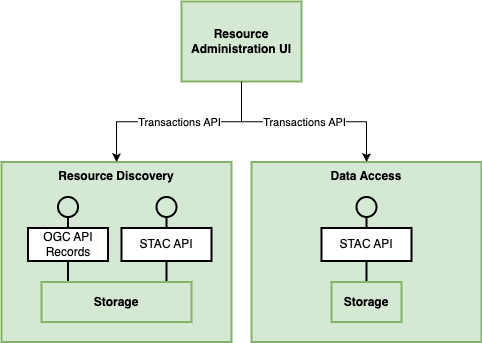

# Design

The web-based administration user interface allows operators and users of a resource catalogue to
maintain metadata and configuration.

Our vision is a unified interface for the platform operators where the different building block (BB) capabilities (in particular,
Resource Discovery and Data Access) can be administrated seamlessly and thus is split between the different building blocks.

## STAC and OGC API Records

The admin interface supports both [STAC API](https://stacspec.org/) and [OGC API Records](https://ogcapi.ogc.org/records/). The two standards are converging and, with some small deviations, 
STAC is basically a rendtition of OGC API Records with more required properties tailored to spatio-temporal data assets, while OGC API Records
is more generic and therefore a more natural choice for non-spatio-temporal data such as documents and workflow definitions. 
For a comprehensive comparison, see this [STAC Spec document](https://github.com/radiantearth/stac-api-spec/blob/bab9bdf22b54cd119e931859b0da13f42091abb8/PRINCIPLES.md).

The administration user interface will feature a branch between the two standards, giving users some context to make the choice between them, 
based on the type of asset they want to edit / add.

The below figures are preliminary design wireframes.

## Version 1 - transactions and STAC extensions

In its first version, the interface will support transactional / atomic metadata changes, i.e. create, read, update, and delete (CRUD)
operations, on individual metadata items (STAC / OGC API Records collections or STAC items).

The web application makes use of the Transactions API of both eoAPI and pycsw, a REST API interface that is already available in both software packages.

All APIs are protected with the Tyk-based API Gateway, which connects to the Identity Management building block for authentication and authorization.

The user interface will support all required STAC fields (for now v1.0.0) and be extenable through React-based frontend code plugins to support additional
metadata as well, such as fields added by STAC extensions. A priority case of extensibility to support is the [Render](https://github.com/stac-extensions/render) extension.

## Version 2 - bulk ingestion and configuration

In its second version, the interface will gain support for mass import/export using external GeoParquet files etc. While numeric data file processing
is left to file managers like the Workspace BB and dedicated data ingestion services like the [Resource Registration](https://eoepca.readthedocs.io/projects/resource-registration) building block.

Also CRUD operations will be routed through the [Resource Registration](https://eoepca.readthedocs.io/projects/resource-registration) building block.

Furthermore, features of resource collections should become configurable through the admin UI, such as (de-) activating data services for collections.