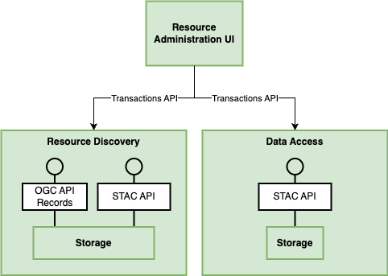
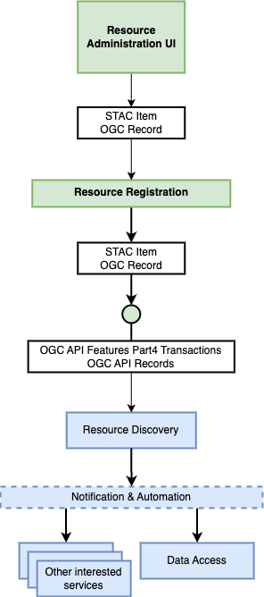

# Resource Administration UI

The web-based administration UI lets platform operators and users maintain catalogue metadata and
configuration. The long-term vision is a single interface for administering capabilities across
multiple building blocks (BBs)—notably Resource Discovery and Data Access—with responsibility for
catalogue types shared across BBs rather than centralised. The current implementation is described in
[Implementation: STAC Manager](#implementation-stac-manager).

## STAC and OGC API - Records

The original design envisaged support for both [STAC API](https://stacspec.org/) and
[OGC API - Records](https://ogcapi.ogc.org/records/). The standards are converging: STAC is largely a
rendition of OGC API - Records with additional required properties for spatio-temporal assets, while
OGC API - Records is more generic and better suited to non-spatio-temporal data such as documents and
workflow definitions. See the [STAC API principles document](https://github.com/radiantearth/stac-api-spec/blob/bab9bdf22b54cd119e931859b0da13f42091abb8/PRINCIPLES.md) for a detailed comparison.

The administration user interface was planned to branch between the two standards, giving users context
to choose based on the type of asset they want to edit or add. The current STAC Manager deployment
covers STAC collections and items only; OGC API - Records administration remains part of the broader
vision.

## STAC Manager

The administration user interface is built on
[STAC Manager](https://github.com/developmentseed/stac-manager), an open-source (MIT-licensed) web
application that lists, creates, reads, updates, and deletes STAC collections and items. It talks to a
STAC API through the
[STAC API - Transaction Extension](https://github.com/stac-api-extensions/transaction) and supports
STAC v1.0.0 required fields.

STAC Manager can be configured to use any OIDC-compliant identity provider. In the EOEPCA+ reference
deployment, authentication and authorization are handled by the Identity Management building block
(Keycloak), with API access protected by the Tyk-based API Gateway in front of the eoAPI STAC API.

The application is extensible through a plugin system that builds the editor forms, so support for STAC
extensions (such as the [Render](https://github.com/stac-extensions/render) extension) and custom
properties can be added without changing the core application. Each plugin defines a section of the
editor via a JSON Schema–like description; deployments can load different plugin sets and custom React
widgets. For the current plugin API, see the plugin packages (`data-core`, `data-widgets`,
`data-plugins`) in the [STAC Manager repository](https://github.com/developmentseed/stac-manager).

A reference deployment runs on the EOEPCA+ development cluster at
[https://eoapi.develop.eoepca.org/manager/collections](https://eoapi.develop.eoepca.org/manager/collections).

!!! NOTE
    The screenshots below were taken from the development deployment and use demo content. The exact
    collections, items, and styling may differ from a production instance.

### Browsing the catalogue

Without signing in, users can browse the catalogue: list the available collections, search by title or
description, and filter by keyword.

### Signing in

Editing actions are gated behind authentication. Choosing **Login** (or attempting to reach a
protected page such as the collection editor) redirects the user to sign in with their account or a
federated identity provider.

After signing in, editing actions become available. A **Create** action appears for adding new
collections, and per-collection options for editing and deletion become available.

### Inspecting a collection

Selecting a collection shows an overview of its metadata—description, temporal and spatial extent,
license, and keywords—together with a paginated list of the items it contains.

Drilling into an item shows its overview (parent collection, date, spatial extent) and the list of its
assets.

### Editing metadata

Collection metadata can be edited through a plugin-driven **Form** view or raw **JSON**.

The **Form** view is generated by the plugin system: each plugin (for example `CollectionsCore`,
`Providers`) renders a section of fields with appropriate widgets and validation. It covers core STAC
fields and anything exposed by installed plugins.

The **JSON** view exposes the raw STAC document for parts the form cannot represent—custom
properties, extensions without a dedicated plugin, nested structures, or unsurfaced link relations.
The two views stay in sync, and changes are saved back to the STAC API via the Transaction Extension.

Item-level browsing is supported; transactional item editing depends on deployment configuration and
may not be enabled.

### Creating a collection

The **Create** action opens the same plugin-driven editor with an empty document. Required fields
(such as the collection identifier and description) are marked, and the form guides the user through
core metadata, spatial and temporal extent, links, providers, and any enabled STAC extensions. On
**Create**, the new collection is written to the STAC API via the Transaction Extension.

## Architecture and roadmap

### Transactions and STAC extensions (current)

The reference deployment uses the Transactions API of eoAPI. The broader platform design also envisages
the same pattern for pycsw and OGC API - Records catalogues. Authentication and API protection follow
the integration described above (see [Implementation: STAC Manager](#implementation-stac-manager)).

### Bulk ingestion and configuration (planned)

A future version of the interface is expected to add bulk import and export (for example via GeoParquet
files). Numeric data file processing remains the responsibility of file managers such as the Workspace
BB and dedicated ingestion services like
[Resource Registration](https://eoepca.readthedocs.io/projects/resource-registration).

CRUD operations may also be routed through Resource Registration rather than calling catalogue
Transactions APIs directly.

Resource collection features—such as (de-)activating data services—should also become configurable
through the administration UI.
