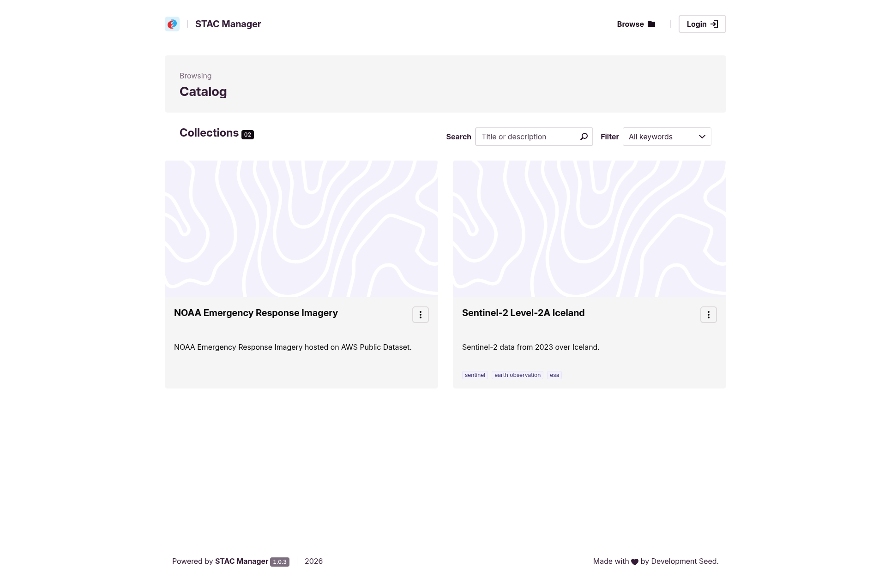
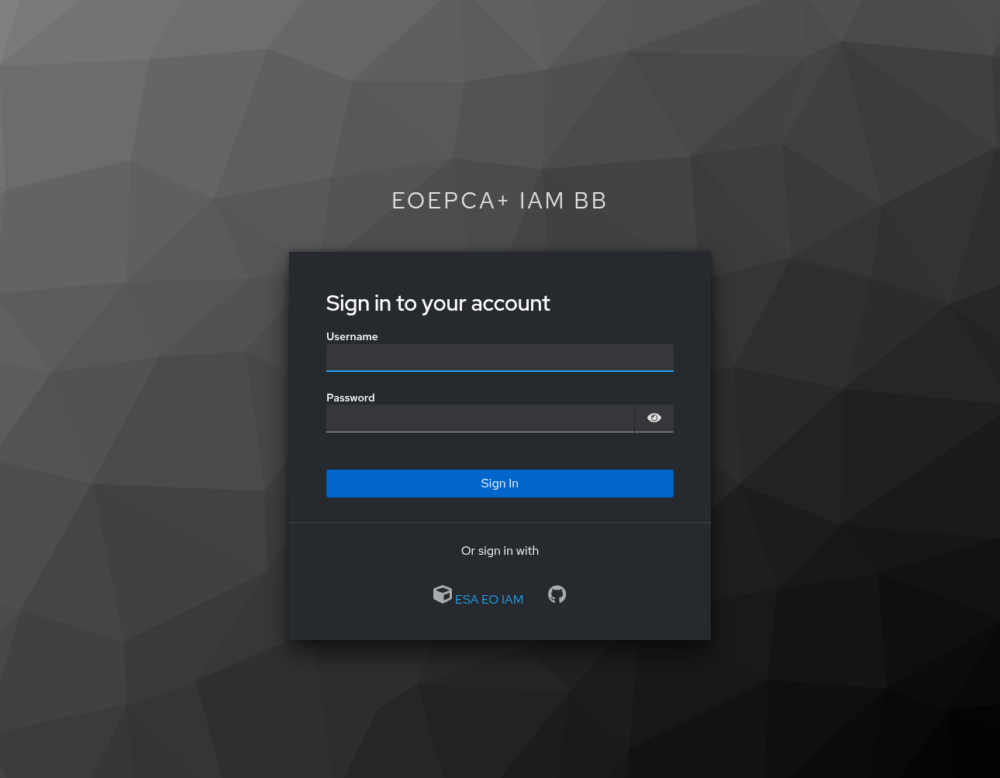
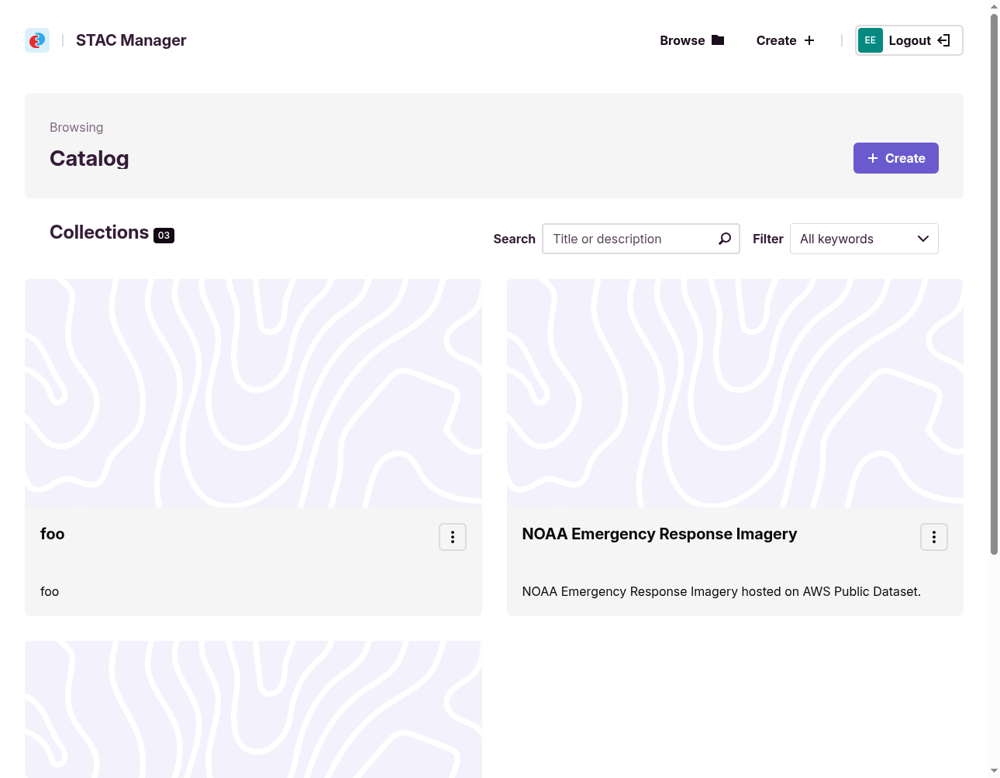
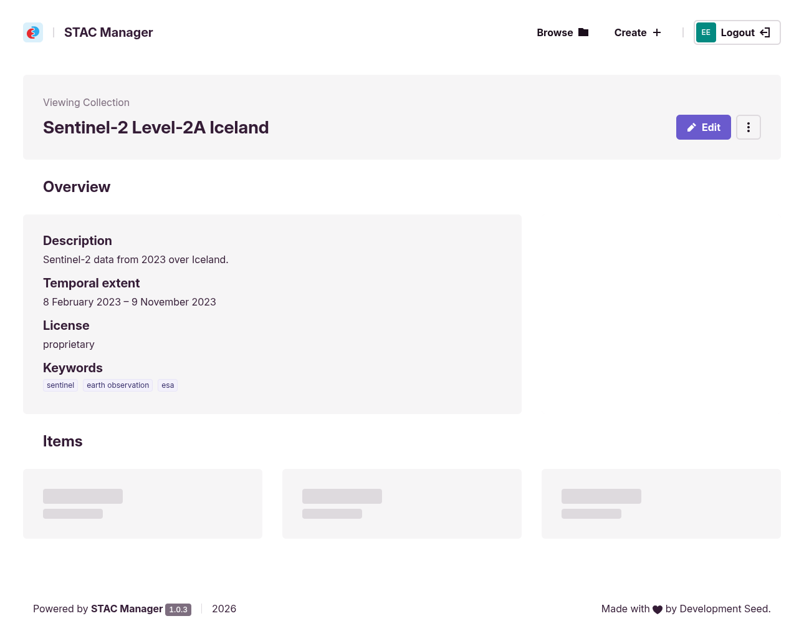
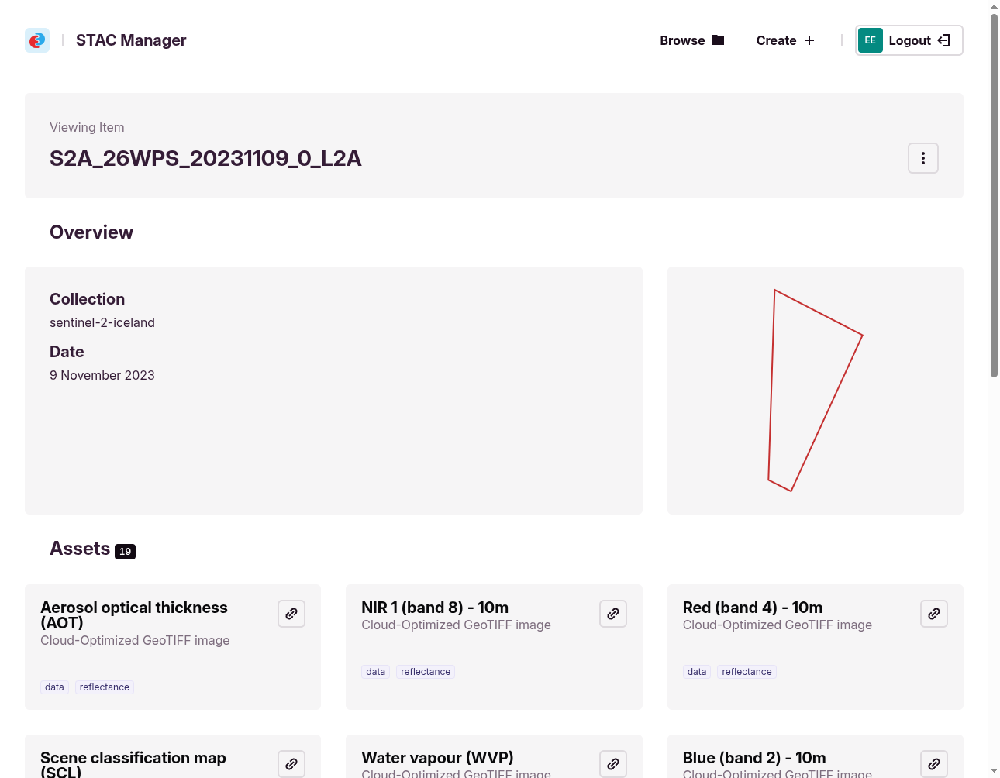
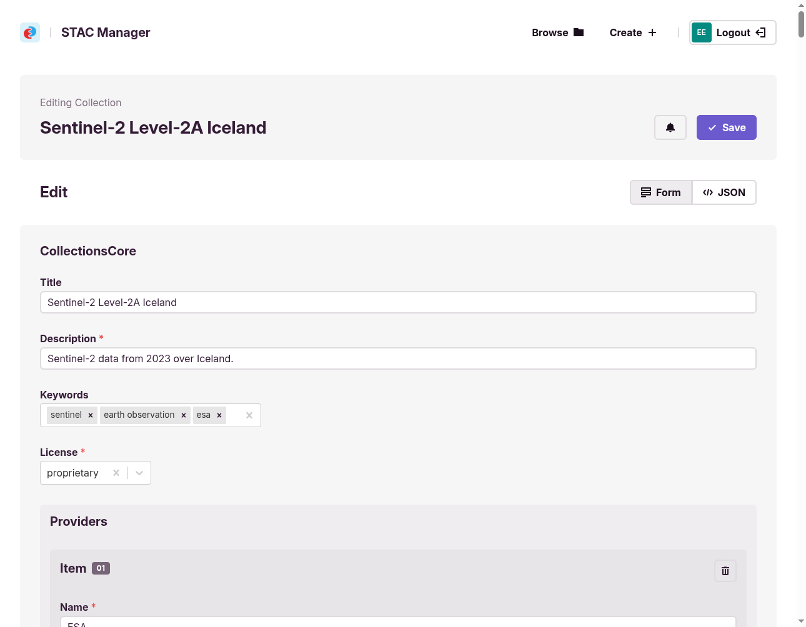
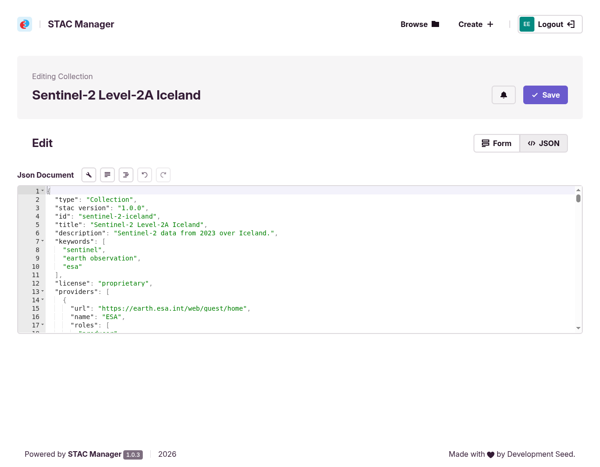
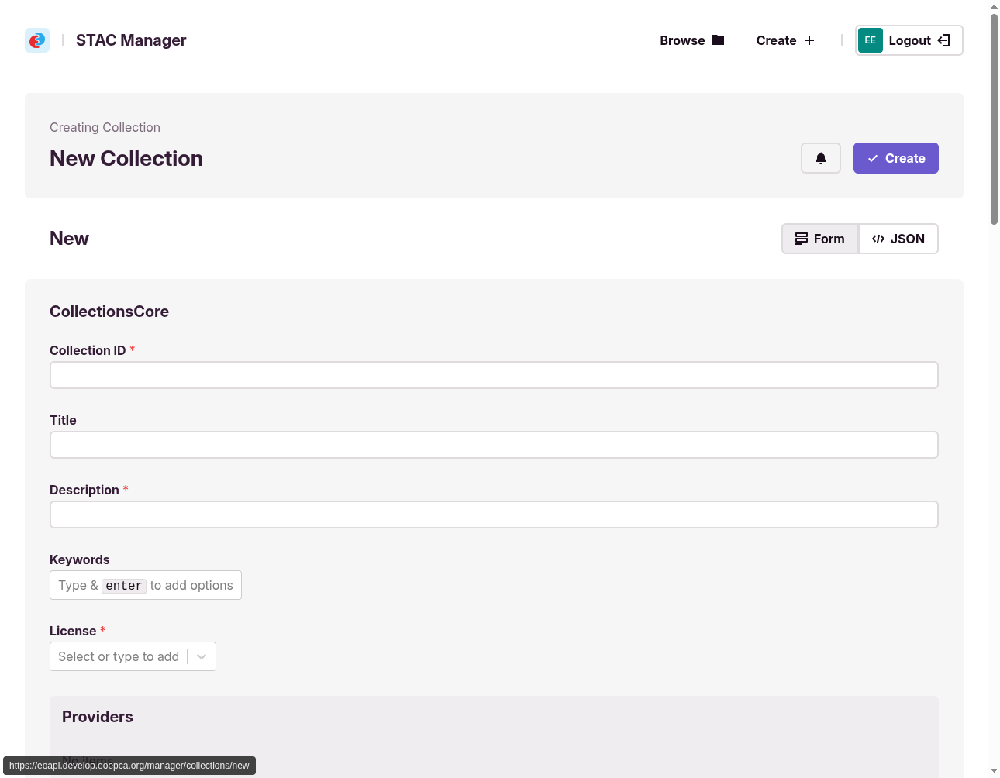

# Resource Administration UI

The web-based administration UI lets platform operators and users maintain catalogue metadata and
configuration. It is built on [STAC Manager](#stac-manager), described below.

## STAC and OGC API - Records

The platform supports both [STAC API](https://stacspec.org/) and
[OGC API - Records](https://ogcapi.ogc.org/records/) for catalogue metadata. STAC focuses on
spatio-temporal assets; OGC API - Records is more generic and suited to documents, workflows, and other
resource types. See the [STAC API principles document](https://github.com/radiantearth/stac-api-spec/blob/bab9bdf22b54cd119e931859b0da13f42091abb8/PRINCIPLES.md) for a detailed comparison.

The administration UI covers STAC collections and items via STAC Manager. OGC API - Records catalogues
(for example pycsw) are not administered through this interface.

## STAC Manager

The administration user interface is built on
[STAC Manager](https://github.com/developmentseed/stac-manager), an open-source (MIT-licensed) web
application that lists, creates, reads, updates, and deletes STAC collections and items. It talks to a
STAC API through the
[STAC API - Transaction Extension](https://github.com/stac-api-extensions/transaction) and supports
STAC v1.0.0 required fields.

STAC Manager can be configured to use any OIDC-compliant identity provider. In the EOEPCA+ reference
deployment, users authenticate through the Identity Management building block (Keycloak). The eoAPI
STAC API is protected by [STAC Auth Proxy](https://developmentseed.org/stac-auth-proxy/), which validates
OIDC tokens and applies endpoint-level access policies.

The application is extensible through a plugin system that builds the editor forms, so support for STAC
extensions (such as the [Render](https://github.com/stac-extensions/render) extension) and custom
properties can be added without changing the core application. Each plugin defines a section of the
editor via a JSON Schema–like description; deployments can load different plugin sets and custom React
widgets. For the current plugin API, see the plugin packages (`data-core`, `data-widgets`,
`data-plugins`) in the [STAC Manager repository](https://github.com/developmentseed/stac-manager).

A reference deployment runs on the EOEPCA+ development cluster at
[https://eoapi.develop.eoepca.org/manager/collections](https://eoapi.develop.eoepca.org/manager/collections).

!!! NOTE
    The screenshots below were taken from the development deployment and use demo content. The exact
    collections, items, and styling may differ from a production instance.

### Browsing the catalogue

Without signing in, users can browse the catalogue: list the available collections, search by title or
description, and filter by keyword.

### Signing in

Editing actions are gated behind authentication. Choosing **Login** (or attempting to reach a
protected page such as the collection editor) redirects the user to sign in with their account or a
federated identity provider.

After signing in, editing actions become available. A **Create** action appears for adding new
collections, and per-collection options for editing and deletion become available.

### Inspecting a collection

Selecting a collection shows an overview of its metadata—description, temporal and spatial extent,
license, and keywords—together with a paginated list of the items it contains.

Drilling into an item shows its overview (parent collection, date, spatial extent) and the list of its
assets.

### Editing metadata

Collection metadata can be edited through a plugin-driven **Form** view or raw **JSON**.

The **Form** view is generated by the plugin system: each plugin (for example `CollectionsCore`,
`Providers`) renders a section of fields with appropriate widgets and validation. It covers core STAC
fields and anything exposed by installed plugins.

The **JSON** view exposes the raw STAC document for parts the form cannot represent—custom
properties, extensions without a dedicated plugin, nested structures, or unsurfaced link relations.
The two views stay in sync, and changes are saved back to the STAC API via the Transaction Extension.

Item-level browsing is supported; transactional item editing depends on deployment configuration and
may not be enabled.

### Creating a collection

The **Create** action opens the same plugin-driven editor with an empty document. Required fields
(such as the collection identifier and description) are marked, and the form guides the user through
core metadata, spatial and temporal extent, links, providers, and any enabled STAC extensions. On
**Create**, the new collection is written to the STAC API via the Transaction Extension.

## Architecture

STAC Manager is the browser-facing component of the administration UI. In the EOEPCA+ reference
deployment it reaches the eoAPI-based Data Catalogue through STAC Auth Proxy. eoAPI provides the STAC
API, including the
[Transaction Extension](https://github.com/stac-api-extensions/transaction) for create, update, and
delete operations.

### Component connectivity

- **STAC Manager** — web application used by operators; obtains OIDC tokens from the Identity
  Management building block (Keycloak) when users sign in.
- **STAC Auth Proxy** — reverse proxy in front of the eoAPI STAC API; validates OIDC tokens and
  applies endpoint-level access policies before forwarding requests to eoAPI.
- **eoAPI STAC API** — persists collection and item metadata in PostgreSQL and exposes it through
  STAC API endpoints, including transactional operations.

Read operations (browse, search) may be available without authentication depending on deployment
policy; write operations require a valid token.

### Catalogues in Resource Discovery

Resource Discovery deploys two catalogue components. STAC Manager targets the **Data Catalogue**
(eoAPI), which maintains STAC collections and items for spatio-temporal datasets. The **Resource
Catalogue** (pycsw) exposes OGC API - Records for broader resource types and is not connected to
STAC Manager. See the [Resource Discovery architecture overview](../overview.md) for the full
component layout.

Programmatic catalogue changes can also be made through the Resource Registration building block,
which acts as a transactional client to both catalogue services.

### STAC extensions

Transactional operations use the STAC API Transaction Extension regardless of which STAC fields or
extensions a document contains. STAC Manager's plugin system (see [STAC Manager](#stac-manager))
determines how those fields are presented in the editor; plugins do not change the API path, only the
document shape sent to and received from eoAPI.
