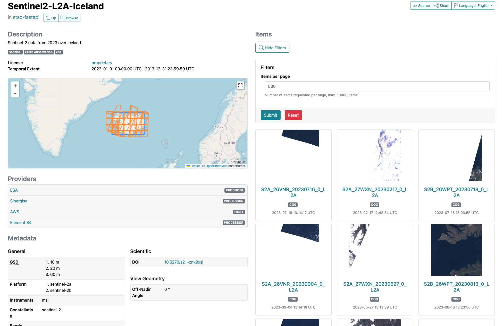

# Low-level STAC data ingestion into eoAPI

In addition to higher-level and user-friendly interfaces, there is a basic mechanism for pushing STAC data into eoAPI's PgSTAC database.

## Use the ingestion script and Makefile

eoAPI-k8s includes a [script](https://github.com/developmentseed/eoapi-k8s/blob/main/ingest.sh) which is also
referenced in the project's [Makefile](https://github.com/developmentseed/eoapi-k8s/blob/main/Makefile), for convenience.

If you pulled the project, e.g. with `git clone https://github.com/developmentseed/eoapi-k8s.git`, you will have both available to you.

## Load data

You will have to have STAC records for the collection and items you wish to load (e.g., `collections.json` and `items.json`).
[This repo](https://github.com/vincentsarago/MAXAR_opendata_to_pgstac) contains a few script that may help you to generate sample input data.

### Preshipped bash script

Execute `make ingest` to load data into the eoAPI service - it expects `collections.json` and `items.json` in the current directory.

### Manual steps

In order to add raster data to eoAPI you can load STAC collections and items into the PostgreSQL database using pgSTAC and the tool `pypgstac`.

First, ensure your Kubernetes cluster is running and `kubectl` is configured to access and modify it.

In a second step, you'll have to upload the data into the pod running the raster eoAPI service. You can use the following commands to copy the data:

```bash
kubectl cp collections.json "$NAMESPACE/$EOAPI_POD_RASTER":/tmp/collections.json
kubectl cp items.json "$NAMESPACE/$EOAPI_POD_RASTER":/tmp/items.json
```
Then, bash into the pod or server running the raster eoAPI service, you can use the following commands to load the data:

```bash
#!/bin/bash
apt update -y && apt install python3 python3-pip -y && pip install pypgstac[psycopg]';
pypgstac pgready --dsn $PGADMIN_URI
pypgstac load collections /tmp/collections.json --dsn $PGADMIN_URI --method insert_ignore
pypgstac load items /tmp/items.json --dsn $PGADMIN_URI --method insert_ignore
```

## Verify the results

Upon successful execution, you will find your data in the STAC API and see it e.g. in STAC Browser.




## Up-to-date information

This document is a copy of the [eoAPI-k8s docs on data management](https://github.com/developmentseed/eoapi-k8s/blob/main/docs/manage-data.md).